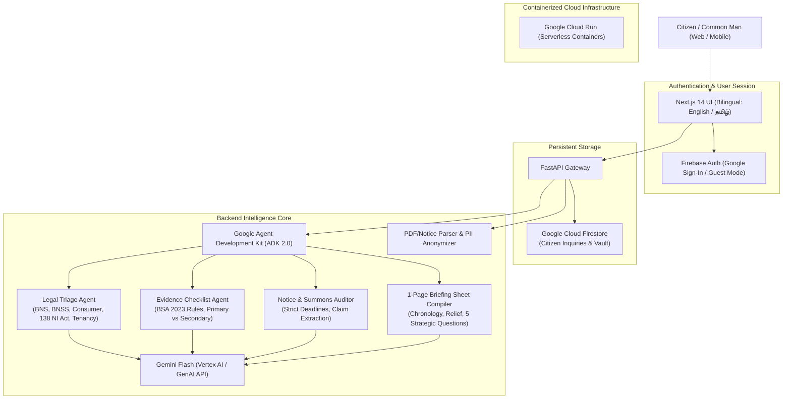

# ⚖️ Satta Thozhan (சட்டத் தோழன்)
### *The Citizen's Pre-Advocate Legal Navigator for India*

[](https://www.python.org/)
[](https://fastapi.tiangolo.com/)
[](https://nextjs.org/)
[](https://pypi.org/project/google-adk/)
[](https://cloud.google.com/vertex-ai)
[](#-architecture--technology-stack)
[](#-architecture--technology-stack)
[](#-docker--cloud-run-deployment)
[](LICENSE)

---

## 🌟 Executive Summary

Before approaching an advocate or police station, the average Indian citizen is typically intimidated by complex legalese, unaware of strict statutory limitation periods (e.g. 30 days under Section 138 NI Act), unprepared with mandatory evidence, and vulnerable to extortion or delayed justice.

**Satta Thozhan (சட்டத் தோழன்)** — meaning *"Legal Comrade / Friend in Law"* — is an AI-powered legal triage, evidence preparation, and notice audit platform. It empowers citizens to understand their rights under Indian Law, organize court-admissible evidence according to the **Bharatiya Sakshya Adhiniyam, 2023 (BSA)**, audit notices received from opponents, and generate a structured **1-Page Advocate Consultation Briefing** before their first legal appointment.

> **Statutory Disclaimer (Advocates Act, 1961):**
> *Satta Thozhan is an informational and triage utility designed to assist citizens in preparing for legal consultations. It does NOT provide certified legal representation or establish an advocate-client relationship.*

---

## 🏗️ Architecture & Technology Stack



### Stack Highlights
- **Frontend**: Next.js 14 (App Router), TypeScript, Tailwind CSS, Lucide Icons, Print-friendly CSS.
- **Backend API**: FastAPI, Pydantic v2, Python 3.11+.
- **Authentication**: **Firebase Authentication** supporting Google OAuth & Anonymous Guest IDs.
- **Database & Vault**: **Google Cloud Firestore** (REST API with Application Default Credentials).
- **AI Agent Framework**: **Google ADK 2.0** (`google-adk==2.10.0`).
- **Foundation LLM**: **Gemini 3.8 / 3.7 / 2.5 Flash** via Google GenAI SDK and Google Cloud Vertex AI with graceful resilient fallbacks.
- **Privacy & Security**: Automated PII masking for Indian identity artifacts (Aadhaar 12-digit, PAN card, Credit/Debit cards, Phone numbers).
- **Deployment**: Multi-stage Docker containers optimized for **Google Cloud Run**.

---

## 🚀 Key Features

### 1. 🔍 Grievance Triage & Forum Navigator
- Ingests citizen grievances in conversational English or Tamil.
- Classifies into Indian legal domains:
  - **Consumer Disputes** (Consumer Protection Act, 2019 / E-Daakhil)
  - **Cheque Bounce & Debt Recovery** (Section 138 Negotiable Instruments Act)
  - **Tenancy & Housing** (State Rent Control Acts / Model Tenancy Act)
  - **Cyber Crime & Financial Fraud** (IT Act / 1930 Helpline / cybercrime.gov.in)
  - **Police & Criminal Complaints** (Bharatiya Nyaya Sanhita - BNS & BNSS, 2023)
  - **Employment & Wages** (Payment of Wages Act, Industrial Disputes Act)
- Highlights **Statutory Limitation Deadlines** and gives actionable **DOs and DON'Ts**.

### 2. 📋 Interactive Evidence Checklist (BSA 2023 Grounded)
- Classifies documents into **Mandatory** (required for admission) vs. **Supportive**.
- Tags evidentiary value under the **Bharatiya Sakshya Adhiniyam, 2023 (BSA)**.
- Informs citizens about **Section 63 BSA Certificates** required for electronic evidence (WhatsApp chats, emails, PDFs).
- Real-time Document Readiness Tracker (% progress).

### 3. 📜 Notice & Court Summons Auditor
- Ingests uploaded PDF legal notices or pasted text.
- Extracts sender details, monetary demands, and **statutory response deadlines** (e.g. 15-day Section 138 notice, 30-day court summons).
- Provides urgent dos and don'ts (e.g., retaining the postal envelope for date-stamp proof of service).

### 4. 📄 1-Page Advocate Consultation Prep Sheet
- Compiles an executive summary for the citizen to carry into their advocate's office.
- Contains:
  - Factual synopsis (in English & Tamil)
  - Chronological sequence of events
  - Precise relief sought
  - Document readiness status
  - **Top 5 Strategic Questions** to ask the advocate (limitation, jurisdiction, court fees, interim relief)
  - Advocate's office notes box
- One-click print / PDF export (`@media print` optimized).

### 5. 🗄️ Persistent Case Vault ("My Cases / என் வழக்குகள்")
- Automatically persists legal queries, evidence checklists, and prep sheets to **Google Cloud Firestore**.
- Inquiries are indexed securely by **Firebase Auth ID** (supporting both signed-in Google users and guest identifiers).
- Allows citizens to revisit, reload, and re-print previous consultation sheets at any time.

---

## ⚙️ Environment Configuration

Templates are provided for both frontend and backend configurations:

### Backend (`backend/.env`)
Copy `backend/.env.example` to `backend/.env`:
```bash
GOOGLE_CLOUD_PROJECT=YOUR_PROJECT_ID
GOOGLE_CLOUD_LOCATION=us-central1
DEFAULT_MODEL=gemini-2.5-flash
ENVIRONMENT=development
# Optional if using Application Default Credentials (gcloud auth application-default login):
GEMINI_API_KEY=YOUR_GEMINI_API_KEY
```

### Frontend (`frontend/.env.local`)
Copy `frontend/.env.example` to `frontend/.env.local`:
```bash
NEXT_PUBLIC_API_URL=http://localhost:8000
NEXT_PUBLIC_FIREBASE_PROJECT_ID=YOUR_PROJECT_ID
NEXT_PUBLIC_FIREBASE_API_KEY=YOUR_FIREBASE_API_KEY
NEXT_PUBLIC_FIREBASE_AUTH_DOMAIN=YOUR_PROJECT_ID.firebaseapp.com
NEXT_PUBLIC_FIREBASE_STORAGE_BUCKET=YOUR_PROJECT_ID.firebasestorage.app
NEXT_PUBLIC_FIREBASE_MESSAGING_SENDER_ID=YOUR_SENDER_ID
NEXT_PUBLIC_FIREBASE_APP_ID=YOUR_APP_ID
```

---

## 💻 Local Quickstart Guide

### Prerequisites
- Python 3.11+
- Node.js 18+ (Node 20 or 24 recommended)
- Git

### 1. Set Up & Run Backend

```bash
cd backend

# Create and activate virtual environment
python -m venv .venv
# On Windows:
.\.venv\Scripts\activate
# On Linux/macOS:
source .venv/bin/activate

# Install dependencies
pip install -r requirements.txt

# Run backend unit tests
pytest ../backend/tests

# Start the FastAPI server
uvicorn app.main:app --host 127.0.0.1 --port 8000 --reload
```
API Documentation will be live at `http://127.0.0.1:8000/docs`.

### 2. Set Up & Run Frontend

In a separate terminal:
```bash
cd frontend

# Install dependencies
npm install

# Build for production (verifies TypeScript & ESLint)
npm run build

# Start the local development server
npm run dev
```
Open your browser and navigate to **`http://localhost:3000`**.

---

## 🐳 Docker & Cloud Run Deployment

### Running locally with Docker Compose:
```bash
docker-compose up --build
```
- Frontend: `http://localhost:3000`
- Backend: `http://localhost:8000`

### Deploying to Google Cloud Run:
```bash
# Set your Google Cloud project
gcloud config set project YOUR_PROJECT_ID

# 1. Deploy Backend to Cloud Run
gcloud run deploy satta-thozhan-backend \
    --source ./backend \
    --platform managed \
    --region us-central1 \
    --allow-unauthenticated \
    --set-env-vars="DEFAULT_MODEL=gemini-2.5-flash,GOOGLE_CLOUD_LOCATION=us-central1"

# 2. Deploy Frontend to Cloud Run
gcloud run deploy satta-thozhan-frontend \
    --source ./frontend \
    --platform managed \
    --region us-central1 \
    --allow-unauthenticated \
    --set-env-vars="NEXT_PUBLIC_API_URL=https://YOUR_BACKEND_URL.run.app"
```

---

## 🔒 Security & Privacy Features
- **No PII Transmission**: Automated regex masking of 12-digit Indian Aadhaar numbers, 10-character PAN identifiers, and 16-digit financial cards before any prompt leaves the application boundary.
- **Statutory Guardrails**: Clear, persistent disclaimers ensuring compliance with the *Advocates Act, 1961* and Bar Council of India guidelines.
- **Zero-Secret Push Compliance**: No private API keys, service account credentials, passwords, or emails committed to the repository.

---

## 📜 License
Released under the [MIT License](LICENSE).
